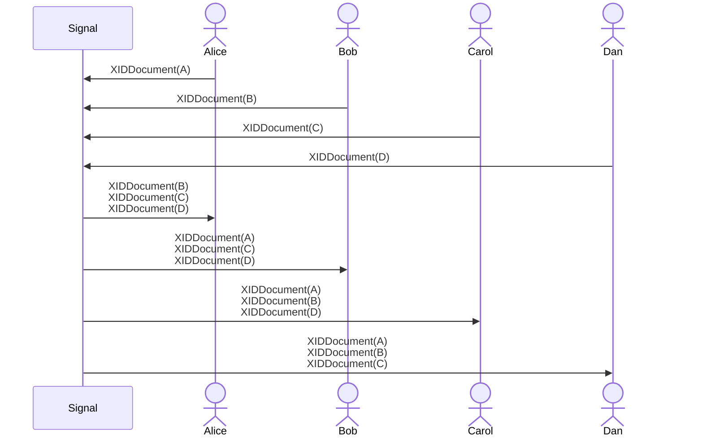
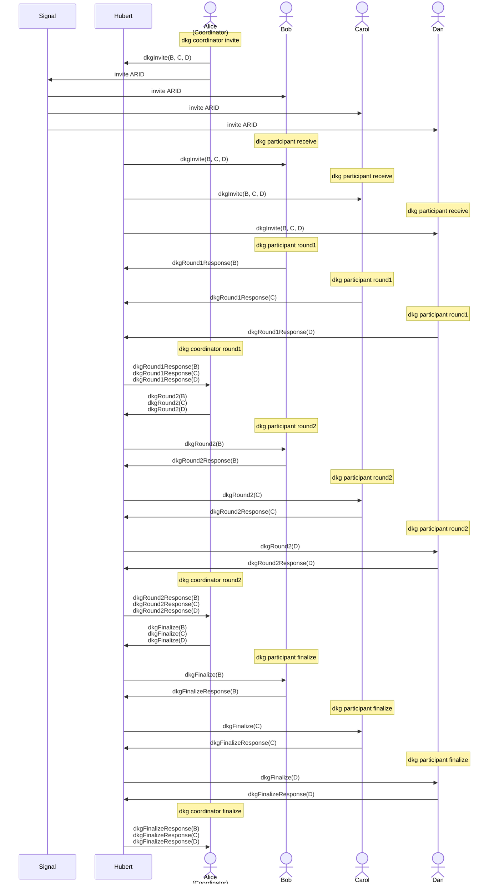
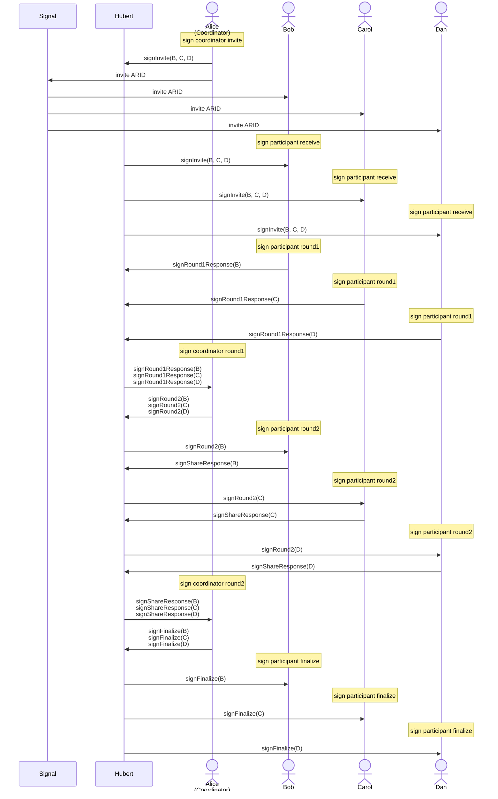

# Frost Sequence Diagram

## Registry Setup

```mermaid
sequenceDiagram
    participant S as Signal
    actor A as Alice
    actor B as Bob
    actor C as Carol
    actor D as Dan

    A->>S: XIDDocument(A)
    B->>S: XIDDocument(B)
    C->>S: XIDDocument(C)
    D->>S: XIDDocument(D)

    S->>A: XIDDocument(B)<br/>XIDDocument(C)<br/>XIDDocument(D)
    S->>B: XIDDocument(A)<br/>XIDDocument(C)<br/>XIDDocument(D)
    S->>C: XIDDocument(A)<br/>XIDDocument(B)<br/>XIDDocument(D)
    S->>D: XIDDocument(A)<br/>XIDDocument(B)<br/>XIDDocument(C)
```

## Distributed Key Generation

```mermaid
sequenceDiagram
    participant S as Signal
    participant H as Hubert
    actor A as Alice<br/>(Coordinator)
    actor B as Bob
    actor C as Carol
    actor D as Dan

    note over A: dkg coordinator invite
    A->>H: dkgInvite(B, C, D)
    A->>S: invite ARID
    S->>B: invite ARID
    S->>C: invite ARID
    S->>D: invite ARID

    note over B: dkg participant receive
    H->>B: dkgInvite(B, C, D)

    note over C: dkg participant receive
    H->>C: dkgInvite(B, C, D)

    note over D: dkg participant receive
    H->>D: dkgInvite(B, C, D)

    note over B: dkg participant round1
    B->>H: dkgRound1Response(B)

    note over C: dkg participant round1
    C->>H: dkgRound1Response(C)

    note over D: dkg participant round1
    D->>H: dkgRound1Response(D)

    note over A: dkg coordinator round1
    H->>A: dkgRound1Response(B)<br/>dkgRound1Response(C)<br/>dkgRound1Response(D)
    A->>H: dkgRound2(B)<br/>dkgRound2(C)<br/>dkgRound2(D)

    note over B: dkg participant round2
    H->>B: dkgRound2(B)
    B->>H: dkgRound2Response(B)

    note over C: dkg participant round2
    H->>C: dkgRound2(C)
    C->>H: dkgRound2Response(C)

    note over D: dkg participant round2
    H->>D: dkgRound2(D)
    D->>H: dkgRound2Response(D)

    note over A: dkg coordinator round2
    H->>A: dkgRound2Response(B)<br/>dkgRound2Response(C)<br/>dkgRound2Response(D)
    A->>H: dkgFinalize(B)<br/>dkgFinalize(C)<br/>dkgFinalize(D)

    note over B: dkg participant finalize
    H->>B: dkgFinalize(B)
    B->>H: dkgFinalizeResponse(B)

    note over C: dkg participant finalize
    H->>C: dkgFinalize(C)
    C->>H: dkgFinalizeResponse(C)

    note over D: dkg participant finalize
    H->>D: dkgFinalize(D)
    D->>H: dkgFinalizeResponse(D)

    note over A: dkg coordinator finalize
    H->>A: dkgFinalizeResponse(B)<br/>dkgFinalizeResponse(C)<br/>dkgFinalizeResponse(D)
```

## Signing

```mermaid
sequenceDiagram
    participant S as Signal
    participant H as Hubert
    actor A as Alice<br/>(Coordinator)
    actor B as Bob
    actor C as Carol
    actor D as Dan

    note over A: sign coordinator invite
    A->>H: signInvite(B, C, D)
    A->>S: invite ARID
    S->>B: invite ARID
    S->>C: invite ARID
    S->>D: invite ARID

    note over B: sign participant receive
    H->>B: signInvite(B, C, D)

    note over C: sign participant receive
    H->>C: signInvite(B, C, D)

    note over D: sign participant receive
    H->>D: signInvite(B, C, D)

    note over B: sign participant round1
    B->>H: signRound1Response(B)

    note over C: sign participant round1
    C->>H: signRound1Response(C)

    note over D: sign participant round1
    D->>H: signRound1Response(D)

    note over A: sign coordinator round1
    H->>A: signRound1Response(B)<br/>signRound1Response(C)<br/>signRound1Response(D)
    A->>H: signRound2(B)<br/>signRound2(C)<br/>signRound2(D)

    note over B: sign participant round2
    H->>B: signRound2(B)
    B->>H: signShareResponse(B)

    note over C: sign participant round2
    H->>C: signRound2(C)
    C->>H: signShareResponse(C)

    note over D: sign participant round2
    H->>D: signRound2(D)
    D->>H: signShareResponse(D)

    note over A: sign coordinator round2
    H->>A: signShareResponse(B)<br/>signShareResponse(C)<br/>signShareResponse(D)
    A->>H: signFinalize(B)<br/>signFinalize(C)<br/>signFinalize(D)

    note over B: sign participant finalize
    H->>B: signFinalize(B)

    note over C: sign participant finalize
    H->>C: signFinalize(C)

    note over D: sign participant finalize
    H->>D: signFinalize(D)
```
